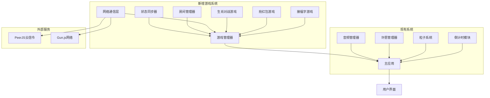
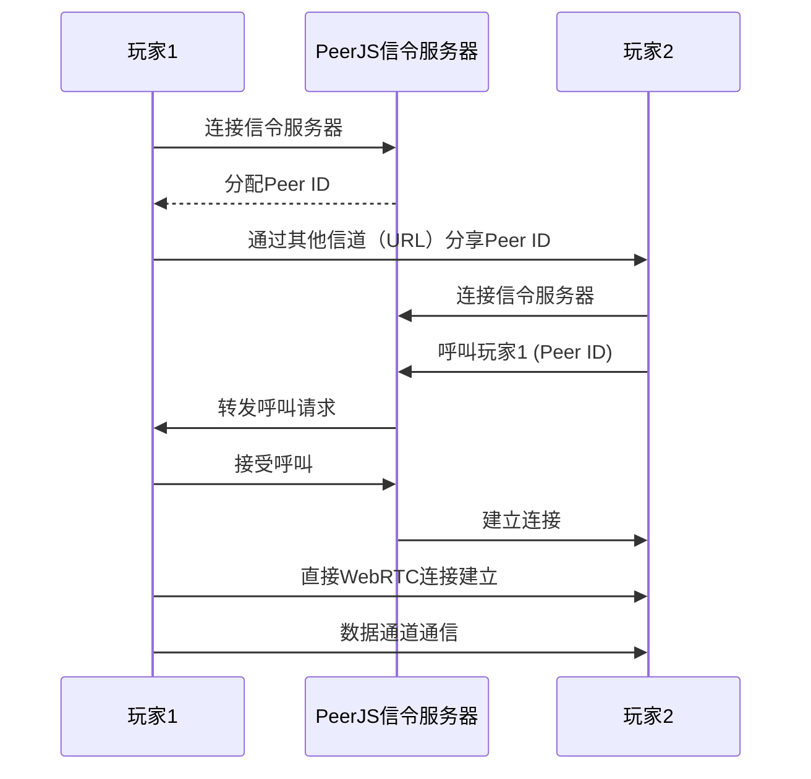

# 春节倒计时网页实时联机小游戏架构设计

## 1. 项目概述

### 1.1 背景
在现有春节倒计时网页（纯前端，模块化结构良好）基础上，添加无需后端服务器的实时联机小游戏功能。要求支持多用户同步交互与竞争，低延迟（<200ms），并与现有系统（倒计时、粒子系统、许愿管理、音频管理）无缝集成。

### 1.2 设计目标
- **纯前端实现**：不依赖专用后端服务器
- **实时同步**：游戏状态多用户实时同步（<200ms延迟）
- **易集成**：与现有代码架构兼容，复用样式和动画
- **可扩展**：支持多个游戏类型，便于未来添加新游戏
- **安全可靠**：防止作弊，保护用户隐私

## 2. 总体架构

### 2.1 架构图



### 2.2 架构层次
1. **用户界面层**：现有HTML/CSS，新增游戏入口和游戏界面
2. **应用逻辑层**：
   - 现有：倒计时、许愿、粒子、音频模块
   - 新增：游戏管理器、各游戏逻辑模块
3. **网络通信层**：WebRTC连接管理器、数据通道、信令客户端
4. **外部服务层**：PeerJS Cloud信令服务、Gun.js去中心化网络

## 3. 技术选型

### 3.1 核心通信技术
| 技术 | 用途 | 优点 | 缺点 | 推荐 |
|------|------|------|------|------|
| **WebRTC** | 点对点实时音视频/数据通信 | 低延迟，浏览器原生支持 | 需要信令服务器 | ✅ 首选 |
| **PeerJS** | WebRTC抽象库，提供信令和连接管理 | 简化WebRTC开发，免费云信令 | 依赖第三方服务 | ✅ 推荐 |
| **Gun.js** | 去中心化实时同步数据库 | 无服务器，去中心化，自动同步 | 学习曲线，数据最终一致性 | ✅ 备用 |
| **Socket.io** | WebSocket库 | 成熟，可靠 | 需要后端服务器 | ❌ 不符合要求 |

### 3.2 辅助技术
- **状态管理**：自定义事件系统（复用现有）
- **数据持久化**：localStorage（存储游戏偏好和本地状态）
- **动画系统**：现有CSS动画 + Canvas（复用粒子系统）
- **音频系统**：现有音频管理器扩展

### 3.3 技术栈决策
**核心方案**：PeerJS + WebRTC
- **信令**：PeerJS Cloud（免费，无需自建服务器）
- **数据传输**：WebRTC DataChannel（直接浏览器到浏览器）
- **备用方案**：Gun.js（当PeerJS不可用时）

## 4. 游戏模块设计

### 4.1 游戏管理器 (GameManager)
**职责**：协调所有游戏，管理游戏生命周期，处理用户输入分发

**接口**：
```javascript
class GameManager {
  constructor(app) {
    this.currentGame = null;
    this.roomManager = new RoomManager();
    this.networkManager = new NetworkManager();
  }
  
  startGame(gameType, options) {}
  endGame() {}
  joinRoom(roomId) {}
  leaveRoom() {}
  sendGameAction(action) {}
}
```

### 4.2 游戏1：协作式"接福字"挑战
**游戏逻辑**：
- 福字从屏幕上方随机位置下落
- 玩家控制一个"福袋"水平移动接住福字
- 每接住一个福字，团队分数增加
- 游戏时间：2分钟

**实时同步需求**：
- 福字生成位置和下落速度（主机权威）
- 玩家位置（每个玩家本地控制，广播给其他玩家）
- 当前分数（主机计算并广播）

**UI设计**：
- 游戏区域：全屏Canvas覆盖
- 玩家指示器：带有玩家名字的彩色福袋
- 分数显示：大型团队分数计数器

### 4.3 游戏2：实时多人"抢红包"竞速
**游戏逻辑**：
- 屏幕中央出现一个大型红包
- 多个玩家同时点击/触摸红包
- 系统检测点击速度，最快者获胜
- 获胜者获得虚拟金币奖励

**实时同步需求**：
- 游戏开始信号（主机广播）
- 玩家点击时间戳（每个玩家发送到主机）
- 获胜者宣布（主机广播）

**UI设计**：
- 红包动画：膨胀、发光效果
- 玩家就绪状态指示器
- 胜利动画：金币雨效果

### 4.4 游戏3：生肖主题快速匹配对战
**游戏逻辑**：
- 玩家选择生肖角色
- 快速反应游戏：屏幕显示指令，玩家快速响应
- 积分系统：正确响应获得积分
- 时间限制：60秒

**实时同步需求**：
- 游戏指令序列（主机生成并广播）
- 玩家响应结果（每个玩家发送到主机）
- 实时排名（主机计算并广播）

**UI设计**：
- 生肖角色选择界面
- 游戏指令显示区域
- 实时排名面板

## 5. 通信方案

### 5.1 WebRTC连接建立流程



### 5.2 信令服务器选择
1. **PeerJS Cloud**（默认）：
   - 免费，无需注册
   - 限制：同时连接数约50-100
   - 适合小型游戏

2. **自托管PeerJS信令服务器**（可选）：
   - 使用现有Python HTTP服务器扩展
   - 提供更好的控制和可靠性

3. **Gun.js去中心化网络**（备用）：
   - 完全无服务器
   - 数据最终一致性

### 5.3 数据通道协议
**消息格式**：
```json
{
  "type": "game-action",
  "sender": "player-id",
  "timestamp": 1640995200000,
  "data": {
    "action": "move-left",
    "payload": {"x": 100, "y": 200}
  }
}
```

**消息类型**：
1. `room-join`：加入房间
2. `room-leave`：离开房间
3. `game-start`：游戏开始
4. `game-action`：游戏动作
5. `game-state`：游戏状态同步
6. `game-end`：游戏结束

## 6. 会话管理与数据同步

### 6.1 房间系统
**房间标识**：URL哈希（`#room-abc123`）

**房间创建流程**：
1. 玩家点击"创建游戏"
2. 生成唯一房间ID（6位字母数字）
3. 创建PeerJS连接，设置房间ID为Peer ID
4. 更新URL：`#room-abc123`
5. 等待其他玩家加入

**房间加入流程**：
1. 玩家通过URL或输入房间ID加入
2. 通过PeerJS连接到房间主机
3. 交换玩家信息（名字、生肖角色等）
4. 同步游戏状态

### 6.2 状态同步策略

| 同步类型 | 方法 | 频率 | 适用游戏 |
|----------|------|------|----------|
| **确定性锁步** | 所有玩家执行相同输入序列 | 每次输入 | 接福字（简单动作） |
| **权威主机** | 主机计算状态并广播 | 50ms | 抢红包（需要仲裁） |
| **乐观本地预测** | 本地立即响应，服务器验证 | 100ms | 生肖对战（快速反应） |

### 6.3 断线处理
1. **检测断线**：心跳包（每5秒）
2. **状态恢复**：
   - 主机保存完整游戏状态快照
   - 断线玩家重连时接收当前状态
   - 其他玩家显示"重新连接"提示
3. **主机迁移**：主机断线时，选择新主机继续游戏

## 7. 与现有系统集成

### 7.1 界面集成
**新增游戏入口**：
```html
<!-- 在现有快速操作区域添加 -->
<section class="game-section" aria-labelledby="game-title">
  <h2 id="game-title" class="section-title">春节小游戏</h2>
  <div class="game-actions">
    <button class="game-btn" data-game="catch-fu">
      🧧 接福字挑战
    </button>
    <button class="game-btn" data-game="grab-red-envelope">
      💰 抢红包竞速
    </button>
    <button class="game-btn" data-game="zodiac-battle">
      🐯 生肖对战
    </button>
  </div>
</section>
```

**游戏界面切换**：
- 游戏启动时，隐藏倒计时区域，显示游戏界面
- 游戏结束时，恢复倒计时区域
- 使用现有CSS过渡动画

### 7.2 模块集成
1. **粒子系统复用**：
   - 游戏特效：复用烟花、爆炸效果
   - 胜利庆祝：盛大结局烟花

2. **音频系统扩展**：
   - 新增游戏音效：点击声、得分声、胜利音乐
   - 复用现有音频管理器接口

3. **事件系统扩展**：
   - 新增游戏事件：`game-started`, `action-performed`, `game-ended`
   - 与现有事件系统兼容

### 7.3 样式复用
- 复用现有按钮样式（`.btn-primary`, `.btn-secondary`）
- 复用卡片样式（`.wish-card` 适配为游戏卡片）
- 复用动画类（`.animate-fade-in`, `.animate-slide-up`）

## 8. 性能优化

### 8.1 网络优化
1. **数据压缩**：对游戏状态数据进行压缩（JSON → 二进制）
2. **增量更新**：只同步变化的状态部分
3. **预测与插值**：客户端预测，服务器校正
4. **优先级队列**：关键动作优先发送

### 8.2 渲染优化
1. **Canvas分层**：背景、游戏对象、UI分开渲染
2. **对象池**：游戏对象（福字、红包）复用
3. **离屏渲染**：预渲染静态元素
4. **请求动画帧节流**：固定60FPS更新

### 8.3 内存管理
1. **对象重用**：避免频繁创建/销毁对象
2. **资源清理**：游戏结束时清理临时资源
3. **事件监听器管理**：适当移除事件监听器

### 8.4 自适应策略
| 条件 | 策略 | 效果 |
|------|------|------|
| 网络延迟 > 300ms | 降低同步频率 | 减少网络负载 |
| FPS < 30 | 简化视觉效果 | 提高渲染性能 |
| 移动设备 | 简化输入处理 | 提高响应速度 |

## 9. 安全性与隐私

### 9.1 安全措施
1. **输入验证**：所有游戏动作在主机端验证
2. **防作弊机制**：
   - 动作时间戳检查
   - 合理动作频率限制
   - 客户端-服务器一致性检查
3. **连接安全**：WebRTC使用DTLS/SRTP加密

### 9.2 隐私保护
1. **匿名游戏**：不收集玩家真实身份信息
2. **本地数据**：游戏偏好存储在本地浏览器
3. **通信加密**：所有游戏数据传输加密
4. **无持久化**：游戏结束后不保留玩家数据（除非明确同意）

### 9.3 风险与缓解

| 风险 | 影响 | 缓解措施 |
|------|------|----------|
| 信令服务器故障 | 无法建立连接 | 切换到Gun.js备用方案 |
| 主机作弊 | 游戏不公平 | 投票踢出机制，主机轮换 |
| 拒绝服务攻击 | 游戏中断 | 限制连接频率，验证玩家ID |

## 10. 部署方案

### 10.1 静态部署
**与现有部署完全兼容**：
1. 添加新JS文件（`game-manager.js`, `game-*.js`）
2. 扩展CSS（`games.css`）
3. 更新`index.html`添加游戏入口
4. 无需后端服务器变更

### 10.2 依赖管理
**外部依赖**：
1. PeerJS库（CDN）：`https://unpkg.com/peerjs@1.4.7/dist/peerjs.min.js`
2. Gun.js（备用，CDN）：`https://cdn.jsdelivr.net/npm/gun/gun.js`

**加载策略**：
- 游戏代码按需加载（懒加载）
- 非游戏页面不加载游戏资源

### 10.3 扩展性考虑
1. **游戏模块化**：未来可轻松添加新游戏类型
2. **可插拔网络层**：支持多种实时通信技术
3. **配置驱动**：游戏参数通过配置文件调整

## 11. 实施路线图

### 11.1 阶段1：基础架构（2-3天）
1. 实现游戏管理器框架
2. 集成PeerJS网络层
3. 创建房间管理系统

### 11.2 阶段2：游戏开发（4-6天）
1. 开发"接福字"游戏（基础）
2. 开发"抢红包"游戏（中等）
3. 开发"生肖对战"游戏（高级）

### 11.3 阶段3：集成测试（2-3天）
1. 多浏览器兼容性测试
2. 跨设备响应式测试
3. 网络延迟模拟测试

### 11.4 阶段4：优化部署（1-2天）
1. 性能优化
2. 安全加固
3. 生产部署

## 12. 技术风险与缓解

### 12.1 主要风险
1. **WebRTC连接成功率**：不同网络环境（NAT/防火墙）影响
2. **信令服务器限制**：PeerJS Cloud免费服务有并发限制
3. **移动端性能**：低端设备Canvas性能不足

### 12.2 缓解策略
1. **备用连接方案**：Gun.js作为备用网络层
2. **自托管选项**：提供自托管信令服务器指南
3. **性能降级**：移动端简化视觉效果

## 13. 成功标准

### 13.1 功能标准
- ✅ 三个游戏均可玩
- ✅ 支持2-4人实时游戏
- ✅ 游戏状态同步延迟 <200ms
- ✅ 与现有系统无缝集成

### 13.2 性能标准
- ✅ 游戏渲染保持 60FPS
- ✅ 内存使用稳定，无泄漏
- ✅ 网络带宽使用合理

### 13.3 用户体验标准
- ✅ 游戏入口直观易发现
- ✅ 游戏界面美观，符合春节主题
- ✅ 游戏操作简单直观


## 14. 后续扩展

### 14.1 短期扩展（3-6个月）
1. 新增游戏类型（猜灯谜、舞龙节奏游戏）
2. 游戏排行榜系统
3. 玩家成就系统

### 14.2 长期愿景（1-2年）
1. 跨平台游戏支持
2. 更复杂的实时协作游戏
3. 与AR/VR技术结合


## 15. 总结

本架构设计实现了**无需后端服务器的实时联机小游戏系统**，通过WebRTC点对点通信技术，在纯前端环境中实现了多用户实时同步。系统与现有春节倒计时应用深度集成，复用现有样式、动画和模块，提供流畅、安全、有趣的春节主题游戏体验。

**核心优势**：
1. **纯前端**：无需服务器变更，保持现有部署简单性
2. **低延迟**：WebRTC直接连接，延迟 <200ms
3. **易扩展**：模块化设计，便于添加新游戏
4. **高兼容**：与现有系统完全兼容，复用现有资源

---

*此架构设计为实施提供了详细蓝图，可立即开始开发。*
